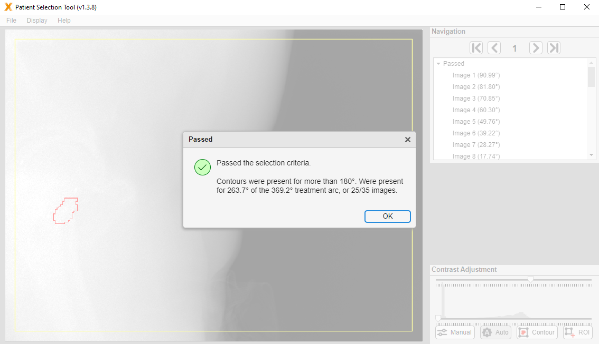

# Patient Selection Tool

**An application for performing prospective and retrospective patient selection for the LEARN markerless motion tracking study.**

[Report Bug](https://github.com/Image-X-Institute/contour-alignment-tool/issues) · [Request Feature](https://github.com/Image-X-Institute/contour-alignment-tool/issues)

---

## Table of Contents

- [Patient Selection Tool](#patient-selection-tool)
  - [Table of Contents](#table-of-contents)
  - [About](#about)
    - [Key Features:](#key-features)
  - [Getting Started](#getting-started)
    - [System Requirements and Prerequisites](#system-requirements-and-prerequisites)
    - [Installation](#installation)
    - [Data](#data)
  - [Usage](#usage)
    - [Loading Data](#loading-data)
    - [Display Options](#display-options)
      - [Contrast Adjustment](#contrast-adjustment)
  - [Build](#build)
    - [Supporting Files](#supporting-files)
  - [Acknowledgments](#acknowledgments)

---

## About

The **Contour Alignment Tool** is a MATLAB-based application designed for identifying patients with sufficient contour visibility in 2D kilovoltage projections for the LEARN study.

### Key Features:
- Load projections along with CT, structure set, and treatment plan files.
- Determine the proportion of kV images with visible contours.
- Visualise 2D contours generated from 3D structures.
- Supports a wide range of 2D projection formats.

---

## Getting Started

### System Requirements and Prerequisites

- **OS**: Windows
- **MATLAB Runtime**: Version 23.2 (2023b)
  [Download MATLAB Runtime](https://au.mathworks.com/products/compiler/matlab-runtime.html)

---

### Installation

1. Download the latest release:  
   [PatientSelectionTool v1.3.8](https://github.com/Image-X-Institute/contour-alignment-tool/releases/download/v1.3.8/PatientSelectionToolInstaller.v1.3.8.exe)
2. Run the installation file.

---

### Data

Required data types:
- CT DICOMs
- Structure DICOM
- Plan DICOM
- Kilovoltage images (`.tiff`, `.xim`, `.hnd`, `.hnc`, `.his`, `.dcm`) - only required for retrospective patient selection

> Sample data is available from the [SPARK Database](https://ses.library.usyd.edu.au/handle/2123/31090).

---

## Usage

### Loading Data

1. **Launch the application** by running the `PatientSelectionTool.exe`.  
   > ⏳ It may take several minutes to load depending on the system.

2. **Load data** via:
   - **Individual Browse**: Manually select CT, plan, structure, and image files.
   - **Clinical Data Browse**: Load entire patient datasets. For ROCK-RT data, choose **YourHospital/liver** for automatically patients load. **(As Below)**

   

3. **Set parameters**:
   - If loading kV images, these parameters are set automatically and you can skip this step.
   - Number of projections
   - Pixel spacing
   - SID, SDD, detector offset (if not found in headers)

   

4. **Select the Structure of Interest** from the dropdown.

5. Click **Proceed** to begin processing (execution time varies).

6. The tool will determine how many DRRs (for prospective patients) or kV images (for retrospective patients) have visible contours.

> Validate projections using the DRR Viewer under the `Display` menu.

---

### Display Options

Located under the **Display** menu:

- **DRR Viewer**: Shows full DRR view with true contour locations.
- **Contour Fill**: Switch between filled or border display.
- **Contour Colour**: Set custom contour colours.
- **Invert Intensity**: Toggle image intensity inversion.

#### Contrast Adjustment

- Use sliders to manually adjust contrast.
- Additional tools for:
  - Auto adjust
  - ROI-based adjust
  - Contour-based adjust

---

---

## Build

To modify or build the tool, use **MATLAB App Designer**.

Project files:
- `ContourAlignmentTool.mlapp` — main application file.
- `PatientSelectionTool.m` - deployment file.

### Supporting Files

- `/ContourAlignmentTool_resources` — application graphics
- `/Dependencies` — core processing modules
- `/Supporting Apps` — additional GUI components

---

## Acknowledgments

Geometry simulation and projection rendering powered by the  
[**Reconstruction Toolkit (RTK)**](https://www.openrtk.org/).

---

<a href="#top">Back to top</a>

