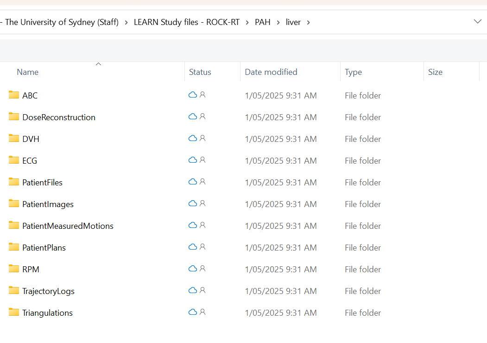

# Contour Alignment Tool

**An application for visualising and aligning contours in kV projections.**

[Report Bug](https://github.com/Image-X-Institute/contour-alignment-tool/issues) · [Request Feature](https://github.com/Image-X-Institute/contour-alignment-tool/issues)

---

For the LEARN trial Patient Selection Tool see [this README](README-PST.md).

## Table of Contents

- [Contour Alignment Tool](#contour-alignment-tool)
  - [Table of Contents](#table-of-contents)
  - [About](#about)
    - [Key Features:](#key-features)
  - [Getting Started](#getting-started)
    - [System Requirements and Prerequisites](#system-requirements-and-prerequisites)
    - [Installation](#installation)
    - [Data](#data)
  - [Usage](#usage)
    - [Loading Data](#loading-data)
    - [Contour Alignment](#contour-alignment)
      - [Navigation](#navigation)
      - [Moving Contours](#moving-contours)
      - [Confidence Selection](#confidence-selection)
    - [Display Options](#display-options)
      - [Contrast Adjustment](#contrast-adjustment)
    - [Data Export](#data-export)
  - [Build](#build)
    - [Supporting Files](#supporting-files)
  - [Acknowledgments](#acknowledgments)
  - [Contact](#contact)

---

## About

The **Contour Alignment Tool** is a MATLAB-based application designed for aligning 3D structure contours with 2D kilovoltage projections.

### Key Features:
- Load projections along with CT, structure set, and treatment plan files.
- Visualise and manually align 2D contours generated from 3D structures.
- Export aligned contours as binary masks for machine learning applications.
- Supports a wide range of 2D projection formats.

---

## Getting Started

### System Requirements and Prerequisites

- **OS**: Windows
- **MATLAB Runtime**: Version 23.2  
  [Download Runtime](https://ssd.mathworks.com/supportfiles/downloads/R2023b/Release/10/deployment_files/installer/complete/win64/MATLAB_Runtime_R2023b_Update_10_win64.zip)  
  [About MATLAB Runtime](https://au.mathworks.com/products/compiler/matlab-runtime.html)

---

### Installation

1. Download the latest release:  
   [ContourAlignmentTool v1.3.7]([https://github.com/Image-X-Institute/contour-alignment-tool/releases/download/v1.3.7/ContourAlignmentTool.v1.3.7.zip](https://github.com/Image-X-Institute/contour-alignment-tool/releases/download/v1.3.7/app.zip))
2. Extract contents to a local directory.

---

### Data

Required data types:
- CT DICOMs
- Structure DICOM
- Plan DICOM
- Kilovoltage images (`.tiff`, `.xim`, `.hnd`, `.hnc`, `.his`, `.dcm`)

> Sample data is available from the [SPARK Database](https://ses.library.usyd.edu.au/handle/2123/31090).

---

## Usage

### Loading Data

1. **Launch the application** by running the `ContourAlignmentTool.exe`.  
   > ⏳ It may take several minutes to load depending on the system.

2. **Load data** via:
   - **Individual Browse**: Manually select CT, plan, structure, and image files.
   - **Clinical Data Browse**: Load entire patient datasets. For ROCK-RT data, choose **YourHospital/liver** for automatically patients load. **(As Below)**

   

3. **Set parameters**:
   - Number of projections
   - Pixel spacing
   - SID, SDD, detector offset (if not found in headers)

   

4. **Select the Structure of Interest** from the dropdown.

5. Click **Proceed** to begin processing (execution time varies).

6. After processing, begin **labelling** and alignment:
   

> Validate projections using the DRR Viewer under the `Display` menu.

---

### Contour Alignment

#### Navigation

- Use on-screen navigation buttons or arrow keys to switch projections.
- Click any projection from the list to jump to it.

#### Moving Contours

- Use:
  - Arrow keys / UI buttons
  - Mouse drag
- Reset with the center reset button.

#### Confidence Selection

- Mark each projection's alignment confidence for tracking.

---

### Display Options

Located under the **Display** menu:

- **DRR Viewer**: Shows full DRR view with true contour locations.
- **Contour Fill**: Switch between filled or border display.
- **Contour Colour**: Set custom contour colours.
- **Invert Intensity**: Toggle image intensity inversion.

#### Contrast Adjustment

- Use sliders to manually adjust contrast.
- Additional tools for:
  - Auto adjust
  - ROI-based adjust
  - Contour-based adjust

---

### Data Export

- Navigate to `File` → `Export` or `Export As...`:
  - **Export**: Saves to the default or previously set directory.
  - **Export As...**: Choose a new export location.

Outputs are binary PNG masks aligned with each projection.

---

## Build

To modify or build the tool, use **MATLAB App Designer**.

Project files:
- `ContourAlignmentTool.mlapp` — main application file.
- `ContourAlignmentTool.prj` — packaging project config.

### Supporting Files

- `/ContourAlignmentTool_resources` — application graphics
- `/Dependencies` — core processing modules
- `/Supporting Apps` — additional GUI components

---

## Acknowledgments

Geometry simulation and projection rendering powered by the  
[**Reconstruction Toolkit (RTK)**](https://www.openrtk.org/).

---

## Contact

**Adam Mylonas**  
_Email_: [adam.mylonas@sydney.edu.au](mailto:adam.mylonas@sydney.edu.au)  
_Image X Institute, The University of Sydney_  
_Faculty of Medicine and Health_

---

<a href="#top">Back to top</a>

